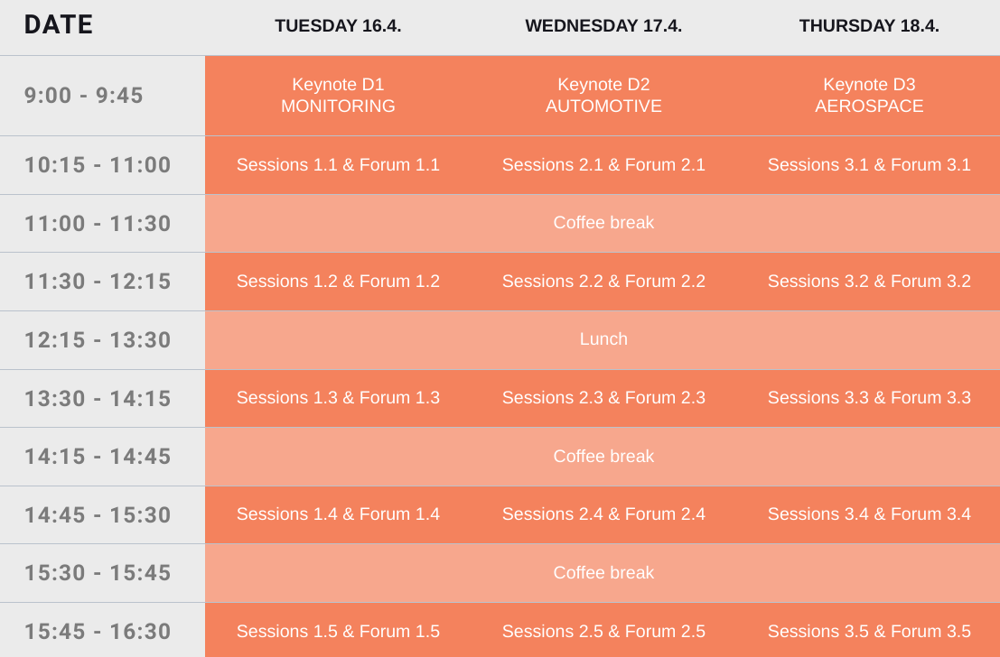

Measurement conference 2024 just wrapped up and it was Dewesoft's biggest conference
yet. More than 500 people from all over the world came together to listen to
interesting lectures, network, play football, drink beer, and just have fun in
general. The conference hosted 70 lectures ranging across a wide variety of
topics in the measurement & test industries, from general data acquisition
and analysis, sensors, buses, loggers, power, structural & rotational dynamics,
to automotive and aerospace testing, and more.

With so many topics it is very hard to be an expert in all of them. That is why when attendees
register for the conference, we give them a magic wand that they can use to make a selection of lectures
they are particularly interested in. We then take these wishes into account
when generating the timetables, so the attendees get to listen to 
material that they find interesting.

This is great for the attendees, but it also means generating timetables is not really
a trivial effort. A decade ago when the conference was much much smaller such
timetables were generated by hand by a single student, but with the crazy
growth of these conferences this just isn't feasible anymore. In this article I will
try to explain how we generate personalized timetables for every attendee of the
Measurement Conference.

## The Problem
To be more specific about what we are working with, here are the constraints:

 - There were approximately 500 registered attendees for the measurement conference,
 - In total we hosted about 70 distinct lectures,
 - The measurement conference spans 3 days, with each day having 5 time slots (so, 15 distinct time slots in general), and each of those has 10 available lecture rooms,
 - Each registered attendee can choose up to 15 lectures they are interested in.

That last bullet point is extremely important. Our task is to arrange the
lectures across the time slots and rooms taking as many wishes into accout as
possible.

For easier understanding, here is a picture of the available time slots and
rooms for the timetable:

It often makes sense to do some preliminary back-of-the-envelope calculations
to see if our problem is actually solvable. For example the venue can hold `3
[days] * 5 [slots] * 7 [rooms] = 105 [distinct lectures] > 70 [registered
lectures]`, so each registered lecture can be held at least once. The rooms
also have different amount of seats available, but the sum total of the chairs
in all rooms was a bit over 1000, meaning there is plenty of empty seats for
all the registered attendees in each time slot.

## Approach
With such specific constraints there isn't any out-of-the-box solution for
generating the timetables, so we have to resort to writing our own software to
do it. Since there is possibly no exact solution to this
problem, this seems like a perfect task for approximation algorithms.
[Simulated annealing](https://en.wikipedia.org/wiki/Simulated_annealing) works
fantastically in practice, so that's what we used.

To simplify the problem we broke it up into two stages and tackled each stage
individually. This actually turned out to be a good idea in multiple ways, even
thought it might affect how "optimal" the resulting timetable is. The two stages were:

  - Stage 1: generate a "valid" (we will define this more formally later) lecture arrangement across the time slots and rooms, and
  - Stage 2: assign the attendees to individual lectures in such a way that they can listen to as many lectures they expressed interest in as possible.

The rest of the article goes into more detail on each individual stage.

TODO: The two stages are independent and sequential, so the first stage is executed
as many times as necessary to generate any valid lecture arrangement, which is
then serialized to the disk and can be used independently by stage 2.

TODO: Instead of doing any sort of parallelism, we just spawn `n` independent
processes and have them write results into an output folder with unique UUID.

## Aside: Simulated Annealing
To establish some common terminology and baseline for explaining the two
stages, we need to quickly explain what simulated annealing is.
Simulated annealing has a scary name, but the idea is relatively simple.
Like other approximation algorithms, it can be used to find good-enough
solutions to optimization problems with constraints, which is what our
timetable problem is.

As a problem solver we are only required to implement three individual steps
(functions): **INIT**, **MOVE**, and **ENERGY**. The rest of the work is done automatically
by the algorithm itself, and while it is not hard to implement, it is easier to
just use a library like [simanneal](https://github.com/perrygeo/simanneal) and
focus on the three steps.

First, in the **INIT** step we generate some random solution to the problem.
The algorithm then repeatedly performs the following two steps some fixed
number of times:

 - during a **MOVE** step we perform a slight permutation of the current solution (find a suitable neighbour), and
 - an **ENERGY** step calculates how close our current solution is to a solved problem.

At each iteration, the algorithm will, based on the probability
calculated from **ENERGY** and current step number, decide if it
wants to make the **MOVE** stick or if it should instead try another one. At the
start of the execution the algorithm will accept **MOVE**s resulting in worse
**ENERGY** (so as to explore a larger solution space), and it will do that less and
less often as the execution progresses.

Computer scientists often like to pretend we are more clever than we really
are, so this process has been likened to the cooling of a metal in metallurgy,
and that is where the name comes from. I think this is a bit unfortunate since
it might scare people away, especially since the algorithm is actually quite
simple to implement and understand, and works really well in practice. 

To give a concrete example of the three functions, consider how we would solve
a [Sudoku puzzle](https://en.wikipedia.org/wiki/Sudoku) with simulated
annealing:

 - the **INIT** step could just take the input puzzle,
 - the **MOVE** step could take any random number (that isn't a part of the puzzle input) in the current solution and change it to a random number between 1 and 9, and
 - the **ENERGY** step could return the total count of duplicate numbers in all rows, colums, and 3x3 subsquares.

And that's it, with very little code we can have computer solve Sudoku for us,
even though it might take a few tries to get a proper solution (global optimum)
instead of something just close-enough (local optimum). There are obviously
much better and faster ways to solve Sudoku, but I think it's kind of magical
that this works.

TODO: modify the NB
> N.B. the steps here automatically encode (and rely on) an invariant that each
> 3x3 subsquare has exactly all the numbers from 1-9 at all times. There are other
> ways to solve Sudoku with simulated annealing, but this one works for
> demonstration purposes.

Just something I noticed during my runs, it is often better to have
**ENERGY** return more nuanced values. So, for the Sudoku example, instead of just
returning the number of bad rows and columns, we should make it also return the
counts of duplicate numbers within those rows and columns (e.g. a row
containing `[1 8 4 3 1 6 9 1 9]` should have an energy of 3 for the two
repeated 1s and one repeated 9 instead of just an energy of 1).

## Stage 1
As mentioned earlier, in the first stage we just concentrate on generating a valid lecture arrangement across the time slots and rooms, and forget about the registered attendees for a second.
This simplifies our problem as there are actually a few additional constraints that we have to take into account, and ignoring any of these would automatically result in an invalid timetable:

  1. Dewesoft employees can hold multiple lectures while other lecturers should only hold exactly one lecture so they can attend the rest of the conference (out of the 70 lectures, approximately 30 were held by Dewesoft employees, and the rest were held by other registered attendees),
  1. no one lecturer should have more than 7 lectures scheduled in total,
  1. some lectures can only appear in certain time slots or certain (subset of) rooms due to equipment requirements,
  1. some "workshop" lectures span multiple consecutive time slots and should be in the same room,
  1. some lecturers are only present at the conference on certain days.
  1. some lectures should be scheduled before others (think basic -> advanced type of lectures),
  1. a lecturer can't hold two lectures in the same time slot,
  1. some lectures are actually presented by multiple lecturers,

That is a lot of constraints.
A question that might pop up is which constraints do we encode into the **MOVE**
part of the algorithm and which into the **ENERGY** part. From development point of
view it is easier to just randomly arrange lectures throughout the timetable during **MOVE** and check for every constraint in the **ENERGY** part, but that can result in timetables taking
way longer to generate: while the **MOVE** is almost free and **ENERGY** isn't
really that expensive to calculate, the algorithm will have to explore a lot
more obviously invalid states, increasing the number of iterations needed to
find a valid timetable.

The way simanneal library works is that at each **MOVE** it creates a copy of the
entire state (timetable) for each so it can backtrack, and copies are
expensive. Since we only ever need to undo the last move this could be solved
by instead adding support for UNDO_MOVE to the library.

If you think back to the Sudoku example, the **ENERGY** function would check if all
TODO

TODO: duplicate some lectures multiple times
TODO: which constraints do we encode into **MOVE** and which into **ENERGY**

- **INIT**: randomly assign lectures to time slots and rooms.
- **MOVE**: swap two lectures. after swapping, rearrange the lectures so that the lectures with most registered attendees get the biggest rooms
- **ENERGY**: check that lecturer doesn't have a lecture in the same slot. all the constraints have to hold. lectures should be held in rooms so that they have enough chairs for all the registered attendees for that lecture. all of these constraints should hold so energy should end up as 0, otherwise we should manually relax some constraints.

At the end, move the lectures around so that the most popular lectures are in the biggest rooms.

## Stage 2
Stage 2 is much simpler than stage one. We now have a valid timetable from stage 1 and all we have to do is create personalized timetables for all registered attendees, taking as many of their wishes into account as possible.

How do we do this? One observation is that for every time slot each attendee
can listen to at most one lecture. But with just this invariant it would be
quite difficult to take the wishes of the guests into account in the **MOVE** and
**ENERGY** steps, and this was the entire point of generating timetables in the
first place.

Still, We can use this invariant in **ENERGY** part, but use a simpler idea for the general approach:

- For **INIT** we randomly assign attendees to every lecture they registered for, regardless of the time slot. If any lecture they chose is repeated multiple times, choose any one random repetition.
- For **MOVE** we pick a random attendee and a random lecture they registered for. Then if the lecture is repeated more than once, we move the attendee to a random other repetition. Here we must make sure to only move the attendee to the other repetition if the target room still has enough free seats for the attendee.
- And finally for **ENERGY** we check how many times an attendee appears two or more times in each time slot, since that means they have an overlap and can't listen to all the lectures they would otherwise want to.

The actual **ENERGY** is actually the # of appearances - 1 squared and should be minimized (explain the 1/3 ~= 5/15 >> 1/15 in terms of how bad it is)

When generating the final timetables at the end we make sure that 

## Analysis of the Approach
While the approach works and was successfully used in practice, there are a few downsides to it.
- more than 95% of wishes were respected
- pypy worked about 2x faster than cpython, resulting in far larger space being checked
- stage 1 took about 1 minute to generate, and stage 2 took about 10, but the process had to be repeated multiple times to make the solution as good as possible

## Conclusion
- a large part of the process is collaborating with organizers
- the final timetable is never really final, people only realize something is wrong after the timetable is already generated (expect final_final_v2 timetables)
- in the end, guests anyway use the timetable as a reference, so many pick other lectures to go to

ideas for alternative approaches:
